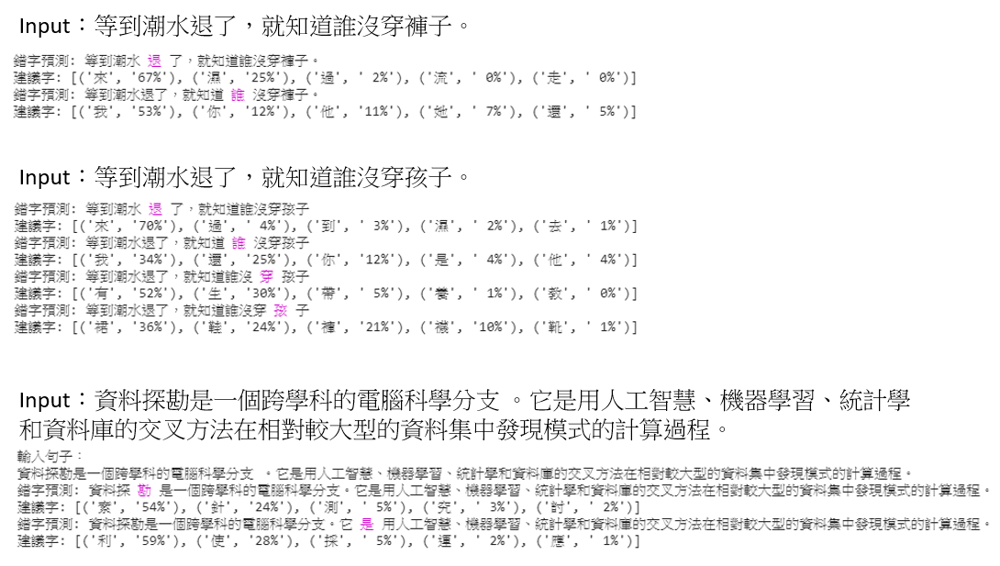

README
===========================

就...MASK每個字 猜字跟概率取前五個 因為第五個之後概率通常極小就不取了

拿這篇改的 感謝LeeMeng大大  
https://leemeng.tw/attack_on_bert_transfer_learning_in_nlp.html

## 說明

* 原文做法

輸入 tokens ： ['[CLS]', '等', '到', '潮', '水', '[MASK]', '了', '，', '就', '知'] ...  
Top 1 (67%)：['[CLS]', '等', '到', '潮', '水', '來', '了', '，', '就', '知'] ...  
Top 2 (25%)：['[CLS]', '等', '到', '潮', '水', '濕', '了', '，', '就', '知'] ...  
Top 3 ( 2%)：['[CLS]', '等', '到', '潮', '水', '過', '了', '，', '就', '知'] ...

原文 MASK掉後替換成三個可能的句子

* 但我只要Mask掉後還原的字  
所以我先把前面加上[CLS]並把每個字都Mask一次(略過標點符號並移除所有空格方便作業)

輸入句子： 
等到潮水退了，就知道誰沒穿褲子。   
[CLS] [MASK]到潮水退了，就知道誰沒穿褲子。  
[CLS] 等[MASK]潮水退了，就知道誰沒穿褲子。  
[CLS] 等到[MASK]水退了，就知道誰沒穿褲子。  
[CLS] 等到潮[MASK]退了，就知道誰沒穿褲子。  
[CLS] 等到潮水[MASK]了，就知道誰沒穿褲子。  
[CLS] 等到潮水退[MASK]，就知道誰沒穿褲子。  
[CLS] 等到潮水退了，[MASK]知道誰沒穿褲子。  
[CLS] 等到潮水退了，就[MASK]道誰沒穿褲子。  
[CLS] 等到潮水退了，就知[MASK]誰沒穿褲子。  
[CLS] 等到潮水退了，就知道[MASK]沒穿褲子。  
[CLS] 等到潮水退了，就知道誰[MASK]穿褲子。  
[CLS] 等到潮水退了，就知道誰沒[MASK]褲子。  
[CLS] 等到潮水退了，就知道誰沒穿[MASK]子。  
[CLS] 等到潮水退了，就知道誰沒穿褲[MASK]。

每一個Mask都會有一個候選清單 選前五個當作錯字判斷標準

[MASK]到潮水退了 ['等', '看', '直', '一', '見']  
等[MASK]潮水退了 ['到', '著', '於', '待', '那']  
等到[MASK]水退了 ['汗', '口', '潮', '薪', '熱']  
等到潮[MASK]退了 ['水', '都', '流', '濕', '就']  
等到潮水[MASK]了 ['來', '濕', '過', '流', '走']  

如果原始字不在候選清單 就標記起來
然後附上建議詞跟概率

錯字預測: 等到潮水 "退" 了，就知道誰沒穿褲子。  
建議字: [('來', '67%'), ('濕', '25%'), ('過', ' 2%'), ('流', ' 0%'), ('走', ' 0%')]

這樣代表"退"的機率比0還低 跟BERT訓練集主要是維基有關 畢竟這句是鄉民用語

## 成果

輸入句子： 等到潮水退了，就知道誰沒穿褲子。

錯字預測: 等到潮水 "退" 了，就知道誰沒穿褲子。  
建議字: [('來', '67%'), ('濕', '25%'), ('過', ' 2%'), ('流', ' 0%'), ('走', ' 0%')]  
錯字預測: 等到潮水退了，就知道 "誰" 沒穿褲子。  
建議字: [('我', '53%'), ('你', '12%'), ('他', '11%'), ('她', ' 7%'), ('還', ' 5%')]  

可以發現 其實效果還不錯
期望可以基於目前方法再去改進

感謝
